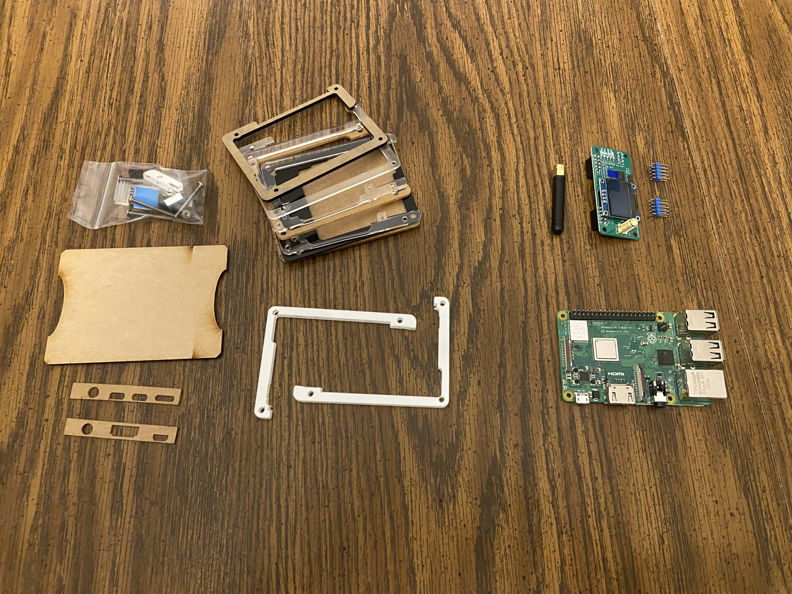
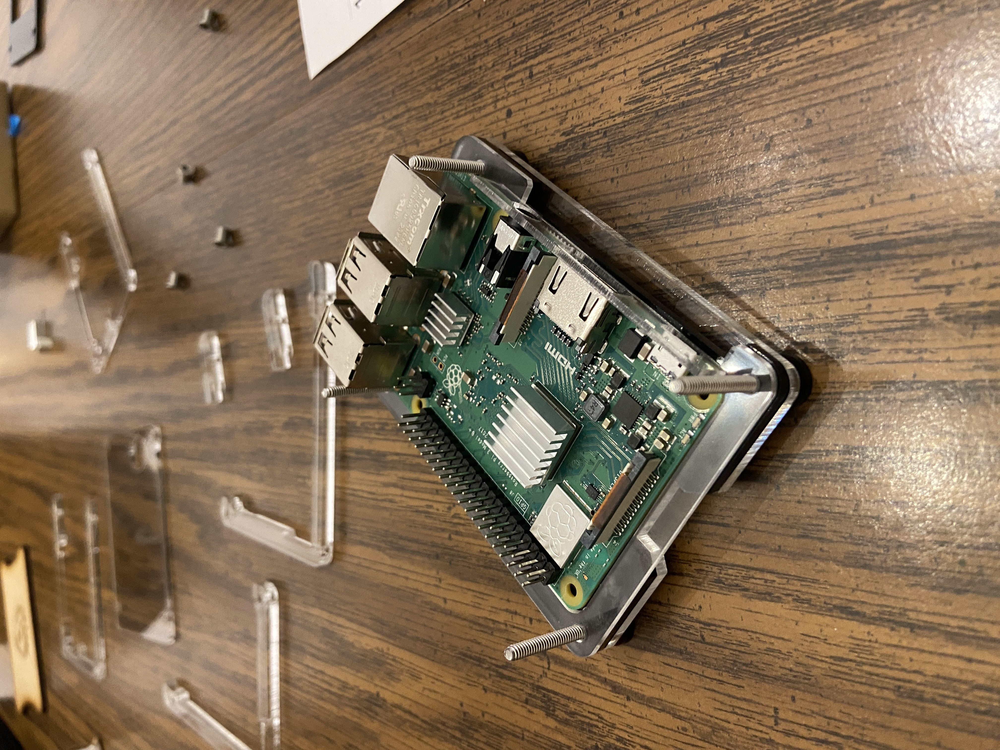
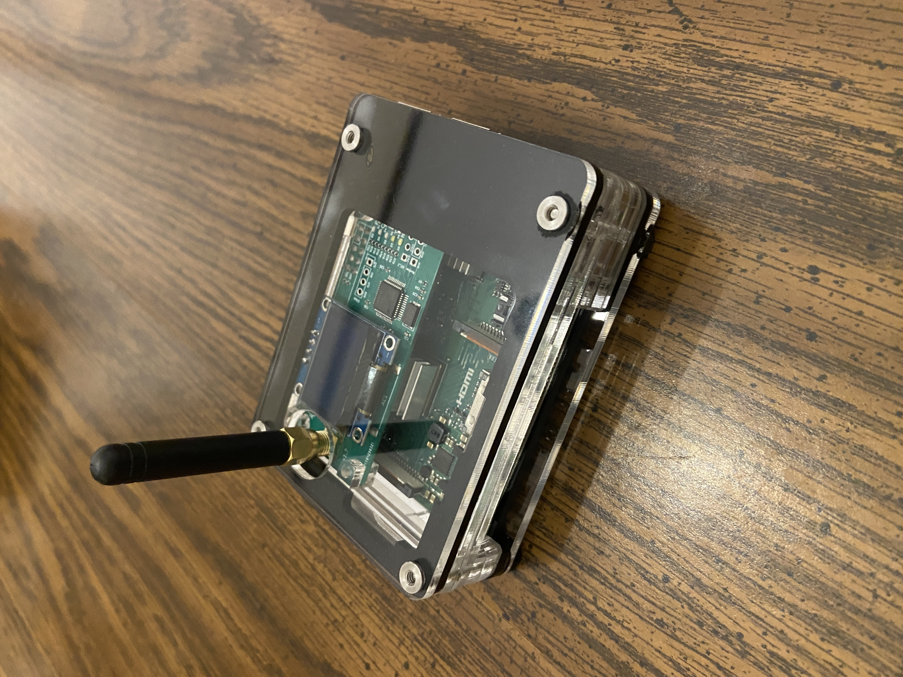

# Pi Hotspot

<div class="project-summary">
  <ul>
    <li><strong>Project:</strong> Raspberry Pi DMR Hotspot</li>
    <li><strong>Time:</strong> ~1 hour</li>
    <li><strong>Skill Level:</strong> Beginner</li>
    <li><strong>Cost:</strong> ~$110–150</li>
  </ul>
</div>

## Purpose

One of my initial concerns when getting my Tech license and a VHF/UHF handheld transceiver was that I might not have any repeaters in range and everything would be silent. I considered a DMR hotspot to be a key fallback that would allow me to make QSOs right away, no matter what.

In practice it doesn't carry the no-infrastructure magic of purely RF communication, but it makes sure you can always talk to someone and get practice being on the air. Without it you might be waiting for a weekly net, or just calling “listening” into a local repeater and hoping someone comes back.

As it turns out, the hotspot also gave me an opening into learning basic Linux and web hosting—but that’s for another article.

A hotspot works roughly like this:

```
Handheld radio → Hotspot → Wi-Fi → Internet → BrandMeister network → Other radios
```

Your handheld talks to the hotspot over RF, and the hotspot connects you to the wider DMR network through the internet.

## Equipment

There are many pre-built hotspots available, but in the DIY spirit I decided to assemble mine. The ingredients were:

### MMDVM Hotspot

https://www.amazon.com/dp/B0BP6ZYF18

You can buy a **simplex** (one antenna) or **duplex** (two antennas) version. The general consensus online seemed to be that simplex was simpler and would accomplish most of my needs, so I didn’t spend too much time researching beyond that.

Some versions include a small OLED screen. I haven't found it especially useful, but it does look cool if you use a transparent case.

### Raspberry Pi

Finally a hobby that gave me a reason to buy one and have a purpose for it.

After some deliberation I went with a **Pi 3**, which seemed like a sweet spot between processing power and power/cooling requirements.

A **Pi Zero** will also do the job. However, if you want a bit more flexibility to run other things beyond just the hotspot—like Python scripts or small utilities—the Pi 3 is a better call.

One thing to note if you buy on Amazon: check what your Pi actually comes with. Mine did **not** include a 5V power adapter, so I had to buy that separately. You will also need a microSD card.

If you don’t want to solder, buy the Pi with header pins already installed so the MMDVM board can mount directly on top.

### Case

I bought a case from C4 Labs:

https://www.amazon.com/dp/B07MQBYLGW

A solid case would work just fine, but I liked the transparent look for style points.

### Approximate Cost

Roughly speaking the whole setup comes out to:

* MMDVM board: ~$40–60
* Raspberry Pi: ~$35–60
* Case: ~$20
* Power supply + SD card: ~$15

Total: about **$110–150**, depending on what parts you choose.

## Assembly

Assembling the Pi, hotspot, and case was a fun little project. Everything went together easily and took about an hour.

With no soldering it was really more of an assembly than a build, but the directions from C4 Labs were straightforward—very much in a LEGO or IKEA style.





I was very happy with the end result.

## Pi-Star Setup

Pi-Star is a software image built specifically for Raspberry Pi hotspots rather than the standard Raspberry Pi OS.

There are plenty of YouTube videos that walk through flashing Pi-Star to an SD card and doing the initial configuration, so I won’t repeat the entire process here. The ones I found helpful were:

[add links]

The only thing that wasn’t obvious was the need to add **01** to the end of your DMR ID when configuring the hotspot. You’ll first need to register for a DMR ID here:

[add link]

Most tutorials I saw skipped over that detail.

## A Small Technical Note

One interesting thing about simplex hotspots is that they only operate on **one DMR timeslot**.

A full DMR repeater can support two simultaneous conversations using Time Slot 1 and Time Slot 2. A simplex hotspot, however, can only handle one at a time.

In practice that doesn’t matter much for personal use, but it’s helpful to understand why hotspots behave a little differently from repeaters.

## Operation

So far I’ve mostly explored the following talk groups:

* **3100 – USA**
* **93 – North America**
* **91 – Worldwide**

Worldwide (91) is a constant stream of QSOs. The trick there is listening to a QSO and being ready to jump on the PTT once it finishes.

A much easier way to make international QSOs is **93 North America**. Despite the name, there are plenty of non-North American stations on it, and it’s far less crowded so you don’t have to be quite so quick.

**3100 USA** is usually quieter but still active enough that someone will often respond if you put a call out.

## Lessons Learned

A few things I noticed after getting things running:

* A **simplex hotspot is more than enough** for most personal use
* **Talkgroup 93** is one of the easiest places to get started
* The **OLED screen is mostly cosmetic**
* A **Pi 3 gives you room to experiment** with other projects later

## Conclusions

The hotspot has really accomplished exactly what I hoped it would: there’s always someone to hear and communicate with on the radio.

That’s a big advantage when you're getting into the hobby. You can operate without spending money on a more expensive mobile or HF rig, or putting up a large antenna.

Does it have the same magic as purely RF communication? No.

Does the sound quality and ease sometimes make it feel a bit like using the internet? Yes.

But it’s a great compromise that keeps you active on the air.

The other unexpected benefit is that having a reason to finally buy a Raspberry Pi opened the door to experimenting with some of my other interests, like Python and data analysis.

While Pi-Star doesn’t automatically store a lot of call or talkgroup data, it still provides enough information to play around with—and it makes me all the more likely to buy another Pi soon.
