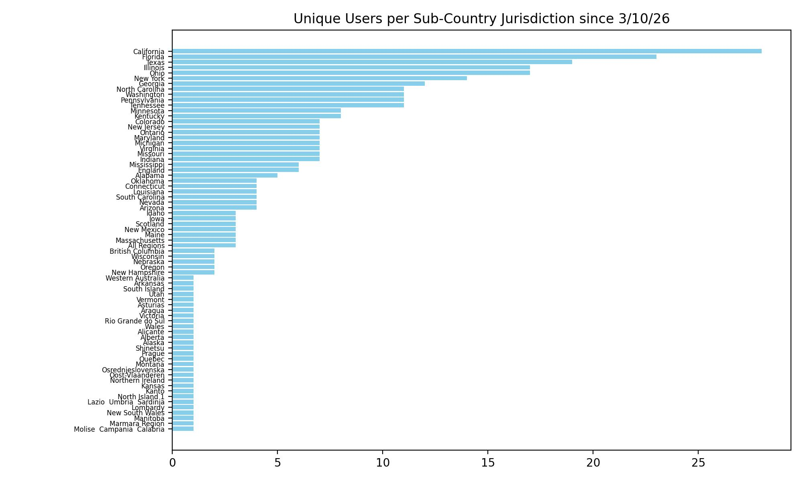

# Hotspot Status

Current snapshot of my MMDVM Raspberry Pi 3B running Pi-Star.

[Analysis of traffic]("..\projects\hotspot_analysis\")

[Hotspot assembly]("..\projects\pi_assembly\")

[New England Digital Radio]("https://newenglanddigitalradio.com/wordpress/)"

### Recent Traffic

<table class="hotspot-table">
  <thead>
    <tr>
      <th>Time (UTC)</th>
      <th>Callsign</th>
      <th>Talkgroup / Slot Info</th>
    </tr>
  </thead>
  <tbody>
    
    <tr>
      <td>{{ entry.time }}</td>
      <td>{{ entry.callsign }}</td>
      <td>{{ entry.tg_slot }}</td>
    </tr>
    
  </tbody>
</table>

### System Status
<ul>
  <li>System Temp: {{ site.data.pi-star.system.temperature }}</li>
  <li>CPU Load: {{ site.data.pi-star.system.cpu_load }}</li>
  <li>Uptime: {{ site.data.pi-star.system.uptime }} </li>
  <li>Memory: {{ site.data.pi-star.system.memory }} </li>
  <li>Disk: {{ site.data.pi-star.system.disk }} </li>
</ul>

